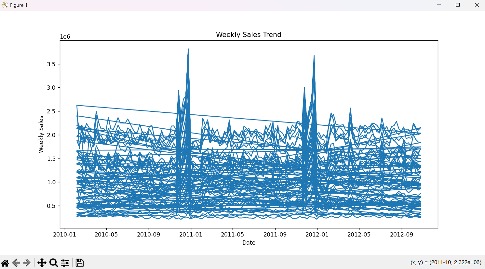
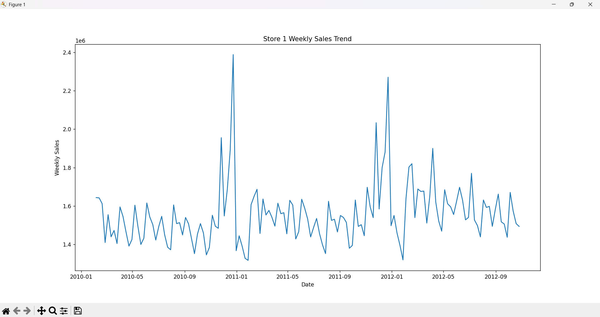
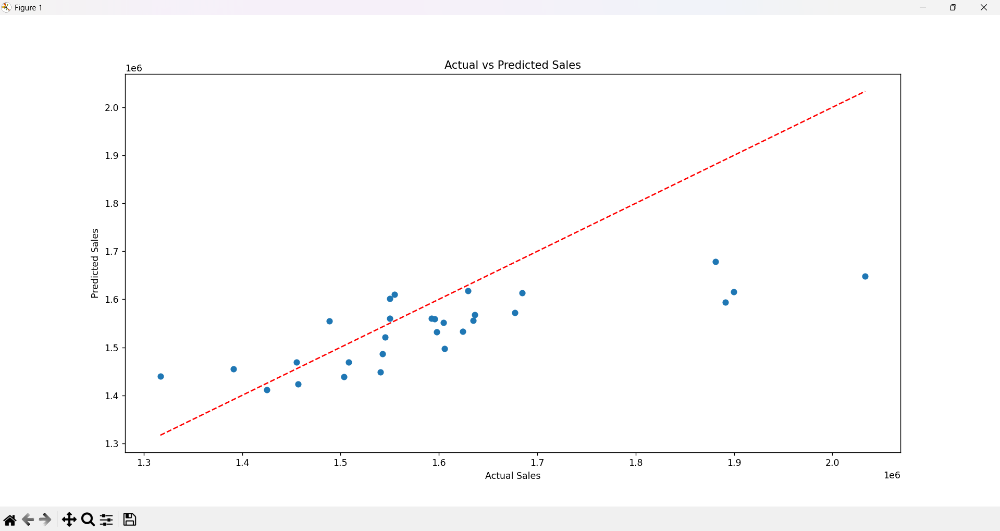

# Walmart Sales Forecasting

## Project Overview
This project uses historical Walmart sales data to predict weekly sales trends using Machine Learning and Linear Regression.

## Features
- Historical sales trend analysis
- Data preprocessing
- Feature engineering
- Linear Regression model
- Prediction visualization
- Model evaluation using MAE and R² Score

## Technologies Used
- Python
- pandas
- matplotlib
- scikit-learn

## Dataset Features
- Store
- Weekly Sales
- Holiday Flag
- Temperature
- Fuel Price
- CPI
- Unemployment

## Workflow
1. Load Dataset
2. Data Cleaning
3. Date Conversion
4. Feature Engineering
5. Train-Test Split
6. Linear Regression
7. Prediction
8. Model Evaluation
9. Visualization

## Model Performance
- R² Score: 0.34

## Future Improvements
- Random Forest Regression
- XGBoost
- Time-Series Forecasting
- Advanced Seasonal Analysis

## Project Output
### Weekly Sales Trend of store

### Weekly Sales Trend of store1

### Actual vs Predicted Sales
